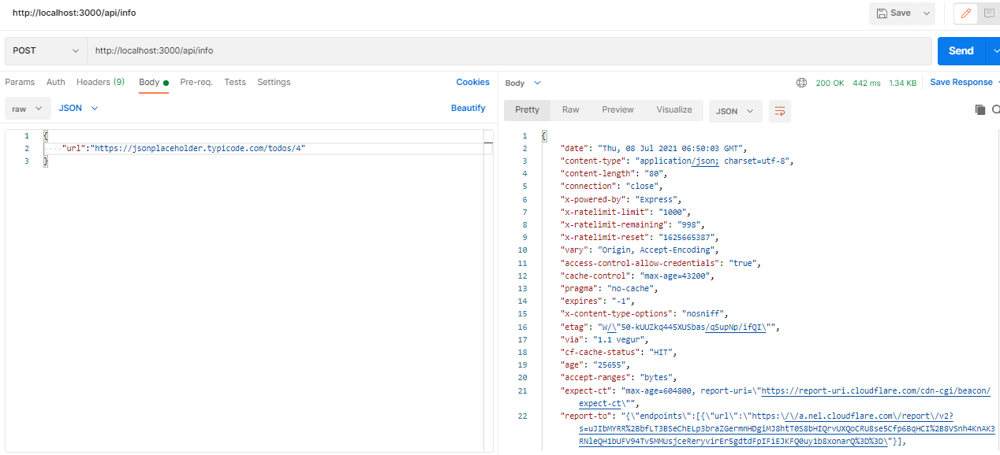
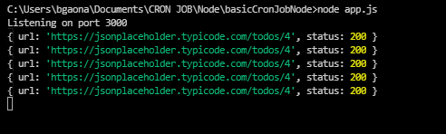

# basicCronJobNode
## Instalation:
```bash
npm install
```

## To execute:
```bash
node app.js
```

## To ping url you can call `api/info`

```bash
curl --location --request POST 'http://localhost:3000/api/info' \
--header 'Content-Type: application/json' \
--data-raw '{
    "url":"https://jsonplaceholder.typicode.com/todos/4"
}'
```


## To schedule ping url you can call `api/infoCron`

```bash
curl --location --request POST 'http://localhost:3000/api/infoCron' \
--header 'Content-Type: application/json' \
--data-raw '{
    "url":"https://jsonplaceholder.typicode.com/todos/4",
    "cronExpression":"* * * * * *"
}'
```
